### In this project, I am going to deploy a simple To-Do application that creates To-Do lists. 
### 1. Backend Configuration
 - Update your package manager, get the location of ***Node.js*** software from Ubuntu repositories and install **Node.js** (the command should install both **node.js** and ***npm***). ***NPM*** is a package manager for Node, just like ***apt*** for Ubuntu, and it's used to install Node modules and packages  

    ***sudo apt update***  
    ***curl -sL https://deb.nodesource.com/setup_12.x | sudo -E bash -***  
    ***sudo apt-get install -y nodejs*** 
    ***node -v***  
    ***npm -v***  
- Create a directory for the *To-Do* project and use the command ***sudo npm init*** to initialize your project (in the created folder). Make some description about your app and confirm that you have **package.json** file created.
     

    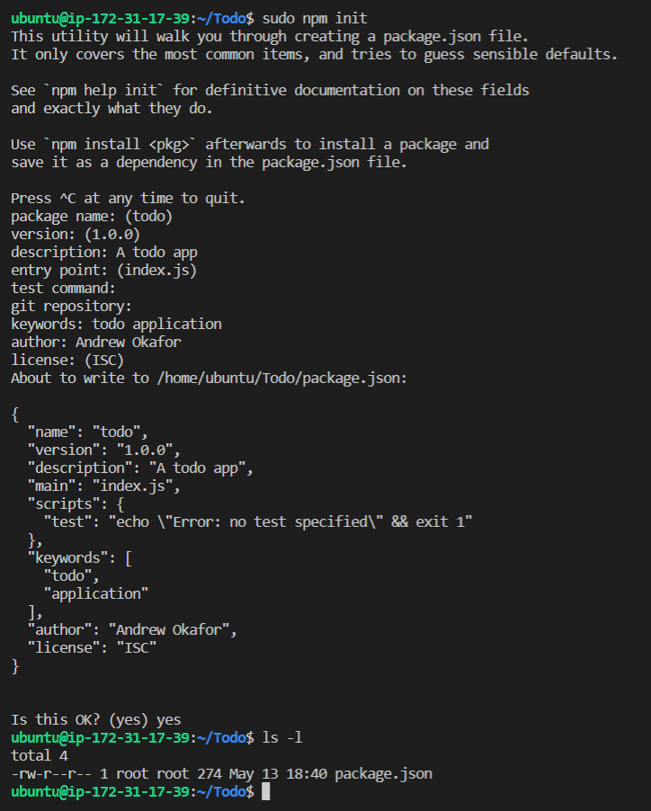  

- Install ***ExpressJs***  
Express is a framework for ***NodeJs*** (alot of things developers would have programmed is already taken care of, out of the box). This simplifies development and abstracts a lot of low level details. For example, Express helps define **routes** of your application, based on HTTP methods and URL's. Also install ***dotenv*** module. Create a file ***index.js*** and put [this](https://www.darey.io/docs/install-expressjs/) code in it. 
     
     
    ***sudo npm install express*** 
    ***sudo touch index.js*** 
    ***sudo npm install dotenv*** 
     
     

- After these installations, it is now time to start our server, to see if it works. Type ***node index.js*** ( cntrl+c to exit)
     
     
    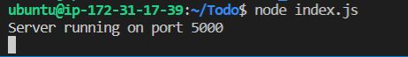
     
     
    We can see that our server is running on port 5000, next is to open this port in EC2 security group (inbound rules).
     
     
    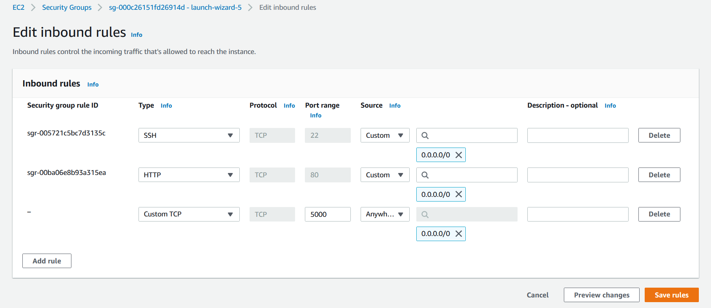
     
     
- Open your browser and put your IP address followed by your port number. Do this while you have the server runing on port 5000.
 

- Create a new folder ***routes*** and a file in it ***api.js*** with [these](https://www.darey.io/docs/install-expressjs/). This file comntains various endpoints (that our To-Do app will depend on) that uses different standard HTTP request methods: POST, GET, DELETE.
     

    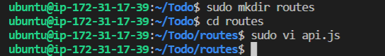 

- We are going to create a ***model*** (a model is at the heart of JavaScript based applications, and it is what makes it interactive), since the app is going to make use of ***Mongodb*** ,  which is a NoSQL database. We will use ***models*** to define the database ***schema*** (this is important so that we will be able to define the fields stored in each Mongodb document). In essence, the ***Schema*** is a blueprint of how the database will be constructed, including other data fields that may not be required to be stored in the database. These are known as virtual properties.  
- To create  a ***Schema*** and a ***model***, we will install ***mongoose*** which is a ***Node.js*** package that makes working with mongodb easier. Change directory to *Todo* folder.  
 
***sudo npm install mongoose***
 

- Create a new folder ***models*** and in this folder, create a file ***todo.js*** and paste [this](https://www.darey.io/docs/models/) code
 

- To make use of this new model, we need to update the *routes* from the ***api.js*** file in the "routes" directory. In the "routes" directory, open ***api.js*** , delete (***:%d***) the code previously there and update with this [this](https://www.darey.io/docs/models/).

- We will make use of ***mLab***which provides ***MongoDB*** database as a service solution (DBaaS). This is the database we will be using to store our data. For instructions on how to sign up and get this working, follow the link [here](https://www.darey.io/docs/mongodb-database/) .
  Some things to look out for here are:  
    1.  Do not forget to extend the time when you *whitelist your IP address* in connecting to Atlas. This is to enable your cluster last for a very long time. (i.e. make sure you change the time of deleting the entry from 6 Hours to 1 Week) . I forgot this the first time I did it. 
    2. Your password for MongoDB user should not have wierd characters else you'll get an error of *unescaped password character*
     
     

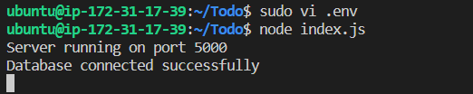 
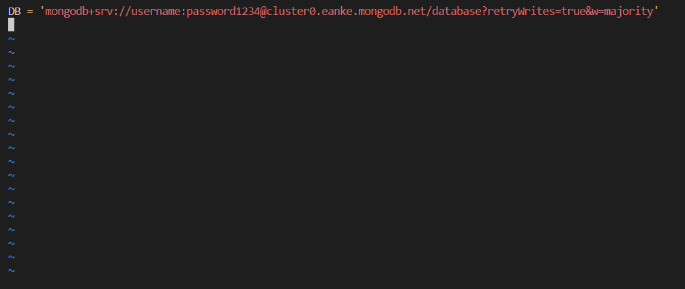
 
 

- Testing the backend code without frontend, using RESTful API.  
So far we have written the backend of the **To-do** application and went on to configure the database. Note that we do not have a frontend UI yet (this is usally written inn ReacJS code). But during development, we will need a way to test the backend code using RESTfulL API. Therefore, we will need to make use of some API development client to test our code. Here, we will use Postman to test our API. 

### 2. Front End Creation
Here we create a user interface for the web client (browser) to interact with application via API. To start out with the front end, use the ***create-react-app*** to scaffold the app.  
- In the same root riectory as the backend code (which is the
 **Todo** directory).  

***npx create-react-app client*** 
 
- If you had issues running this command like I did, update you node package manager (npm) 
 

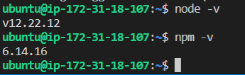
 

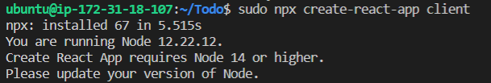
 

***npm cache clean -f*** 
***npm install -g n*** 
***sudo n stable***  
For more information on this click [here](https://phoenixnap.com/kb/update-node-js-version) 

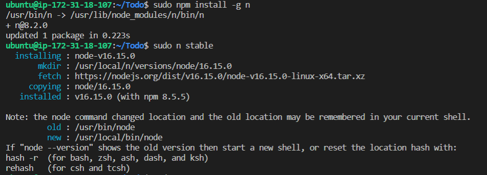
 

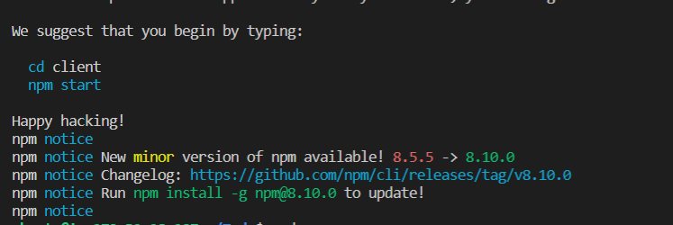
 
 

- If all is fixed you should get a successful message.

 
 

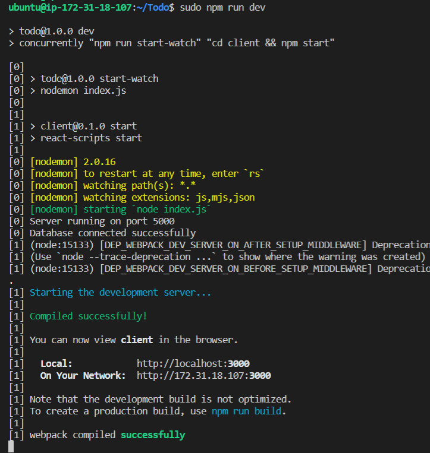
 

- To load react in your browser, open TCP port 3000 and ype the IP on your browser.
 
 

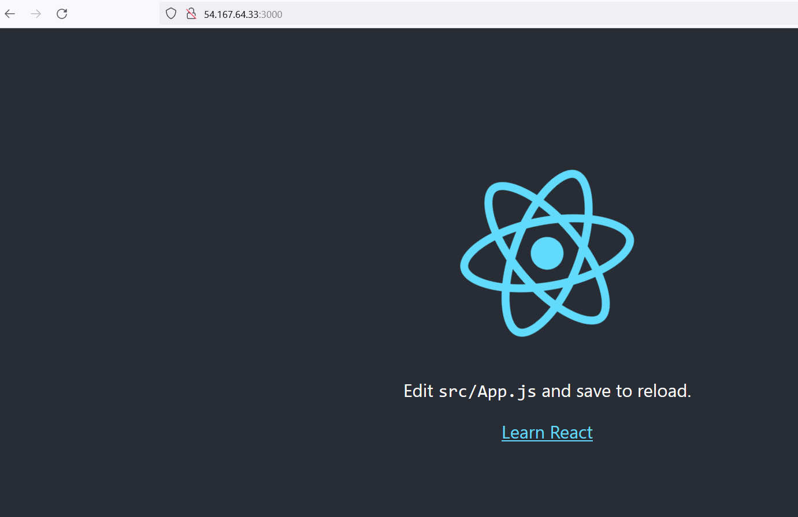
 
 

- Create three files ***input.js*** , ***ListTodo.js*** , and ***Todo.js*** in a newly created folder components in the */home/Todo/client/src* directory 
 
 

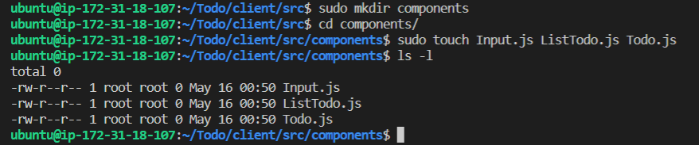
 
 

- These are where you will paste your react code.  
- Move to your *src* folder and install ***axios***
 
 

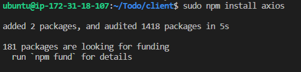
 
 

- If  the content of files are properly written, the files should run correctly. 
 
 

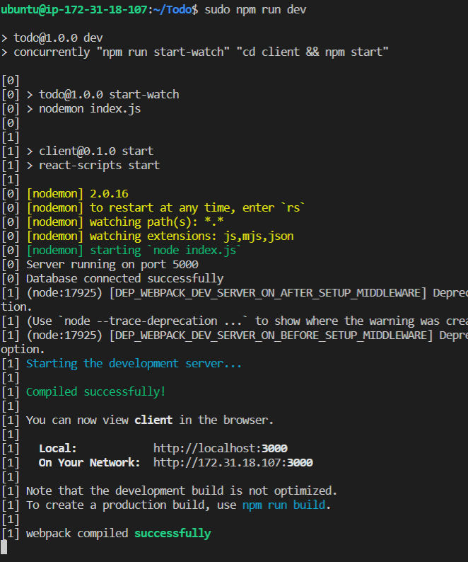
 
 

The web page would look like this:
 
 

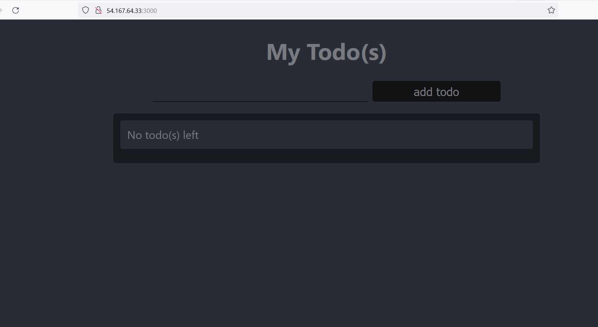

